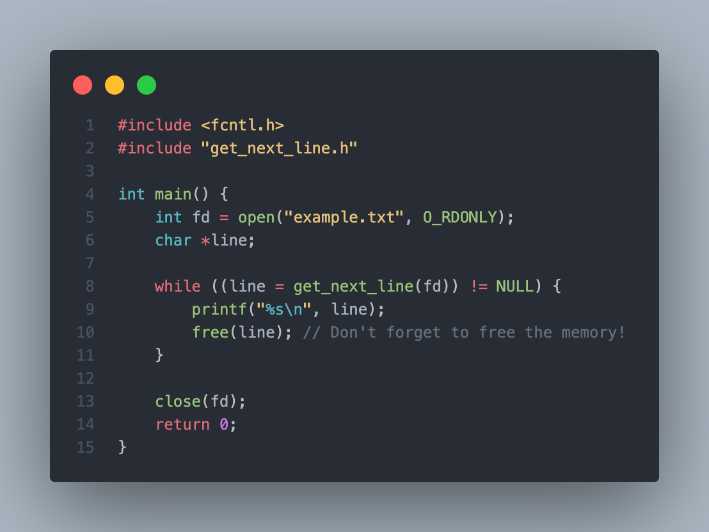

# 📄 Get Next Line

**Get Next Line** is a C library designed to read a single line from a file descriptor. It simplifies reading lines from files and standard input, making it a perfect utility for projects that require efficient line-by-line processing.

<p align="center">
  
</p>


## 🚀 Features

- **Easy to Use**: Simplifies the process of reading lines from files or standard input.
- **Dynamic Memory Management**: Allocates and frees memory efficiently to handle varying line sizes.
- **Robust**: Handles edge cases like empty lines and EOF (end-of-file) conditions gracefully.

## 🛠️ Installation

To use the `get_next_line` library in your project, follow these steps:

1. **Clone the Repository**:
	```bash
	git clone https://github.com/Abdelmathin/get_next_line.git
	```

2. **Navigate to the Project Directory**:
	```bash
	cd get_next_line
	```

3. **Compile the Library**: You can compile the library using `make`:
	```bash
	make
	```
4. **Include the Library in Your Project**: Include the header file in your C source files:
	```c
	#include "get_next_line.h"
	```

## 📚 Usage

To read a line from a file descriptor, use the `get_next_line` function. Here’s a simple example demonstrating its usage:

```c
#include <fcntl.h>
#include "get_next_line.h"

int main() {
    int fd = open("example.txt", O_RDONLY);
    char *line;

    while ((line = get_next_line(fd)) != NULL) {
        printf("%s\n", line);
        free(line); // Don't forget to free the memory!
    }
    
    close(fd);
    return 0;
}
```

### Function Prototype

```c
char *get_next_line(int fd);
```
- Parameters:
	- `int fd`: The file descriptor to read from.

- Returns:
	- A pointer to the line read from the file. Returns `NULL` if there are no more lines or an error occurs.

## 💡 Notes

- Ensure you handle memory management properly by freeing the returned line after use.
- The library is designed to work with files and standard input.

## 📄 Example

To illustrate the library in action, create a file named `example.txt` with the following content:

```text
Hello, World!
This is a test.
Get Next Line is easy to use.
```

Then run the example code provided above. You should see the lines printed one by one:

```text
Hello, World!
This is a test.
Get Next Line is easy to use.
```

## 🧪 Testing

You can run tests to validate the functionality of the `get_next_line` library. Make sure to implement your test cases in a separate file. Here's an example:


```c
#include "get_next_line.h"
#include <assert.h>
#include <fcntl.h>

void test_get_next_line() {
    int fd = open("test.txt", O_RDONLY);
    char *line;

    line = get_next_line(fd);
    assert(strcmp(line, "First line") == 0);
    free(line);

    line = get_next_line(fd);
    assert(strcmp(line, "Second line") == 0);
    free(line);

    close(fd);
}

```

## 📝 License

This project is licensed under the MIT License - see the LICENSE file for details.


## 🤝 Contributing

Contributions are welcome! If you have suggestions for improvements or want to report issues, please create a pull request or open an issue in this repository.
